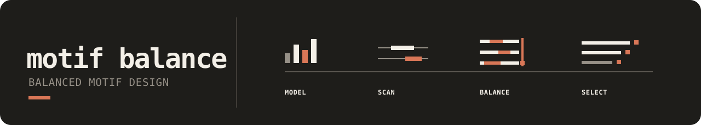

# 

Design DNA against several motif models at once. Motif Balance lets researchers
declare which motif preferences should coexist within a finite sequence, then
returns an exact-size ranked portfolio without requiring the sequence, motif
variant, placement, strand, or shared-coordinate pattern to be prescribed in
advance. Under `normalized_llr_v1`, it maximizes the weakest normalized motif
score; an optional minimum-distance constraint can keep the returned sequences
distinct.

This repository is a public prerelease and is not approved for PyPI publication.
The `0.3` alpha supports CPython 3.12–3.14 on POSIX systems; Linux is the hosted
CI authority and macOS is exercised locally. Windows is not yet a supported
runtime.
Outputs are inspectable sequence hypotheses under the supplied models. They do not establish
binding, expression, synthesis readiness, biological function, or global
optimality.

## First design

```bash
uv sync --locked --group dev
uv run motif-balance design examples/synthetic-pairwise/design.yaml --check
uv run motif-balance design examples/synthetic-pairwise/design.yaml \
  --out /tmp/motif-balance-result
uv run motif-balance inspect /tmp/motif-balance-result
uv run motif-balance inspect /tmp/motif-balance-result \
  --format html --out /tmp/motif-balance-review.html
uv run motif-balance inspect /tmp/motif-balance-result \
  --format svg --view candidate --candidate 1 \
  --out /tmp/motif-balance-candidate.svg
```

The sanitized [committed candidate review](examples/synthetic-pairwise/candidate-review.svg)
connects each supplied motif model to its selected strand-aware match, shared
sequence coordinates, and base-level score support without requiring a browser
application.

The immutable bundle contains five canonical files—`design.json`,
`motifs.json`, `candidates.tsv`, `matches.tsv`, and `manifest.json`—plus a
derived FASTA export. `inspect` verifies bytes and score replay before it
creates text, JSON, SVG, or optional script-free HTML. Review files remain
outside the bundle and do not change its identity.

## Choose a route

| Goal | Route |
| --- | --- |
| Install, design, and inspect | [Quickstart](docs/quickstart.md) |
| Understand the method | [Concepts](docs/concepts.md) and [methods](docs/methods.md) |
| Author inputs | [Motif models](docs/motif-models.md) and [DesignSpec](docs/design-spec.md) |
| Score an existing sequence | [Sequence scoring](docs/score-sequences.md) |
| See and read a result | [Inspection and visual review](docs/reference/result-inspection.md) |
| Integrate the package | [Public contract](docs/reference/public-contract.md) |
| Maintain or change it | [Architecture](ARCHITECTURE.md), [engineering contracts](DESIGN.md), and [documentation index](docs/index.md) |

The public Python surface is five nouns—`MotifModel`, `DesignSpec`,
`MotifMatch`, `Candidate`, and `Portfolio`—and two verbs: `design` and `score`.
The ordinary CLI has three journeys: `design`, `score`, and `inspect`. The
package fetches no motif database, discovers no result workspace, and assigns
no experiment or publication meaning to an output.

Run `bash ./scripts/agent-verify` for the same package gate used by CI.
