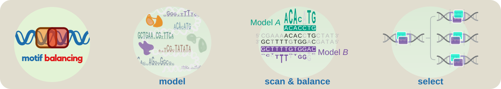
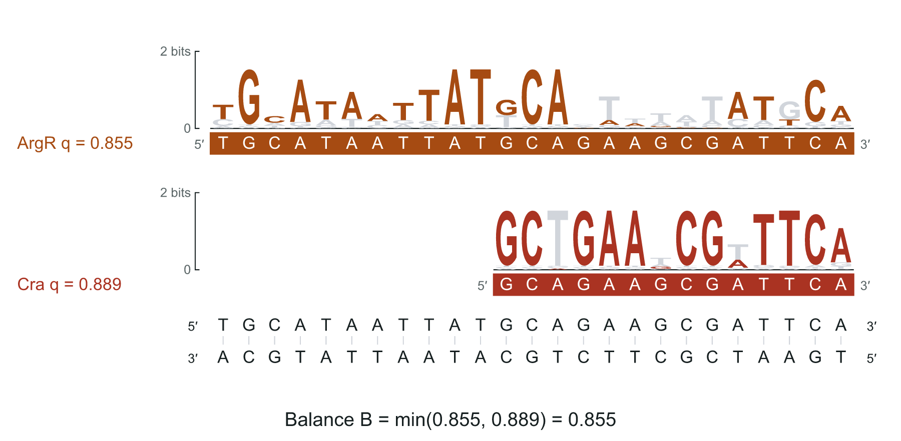
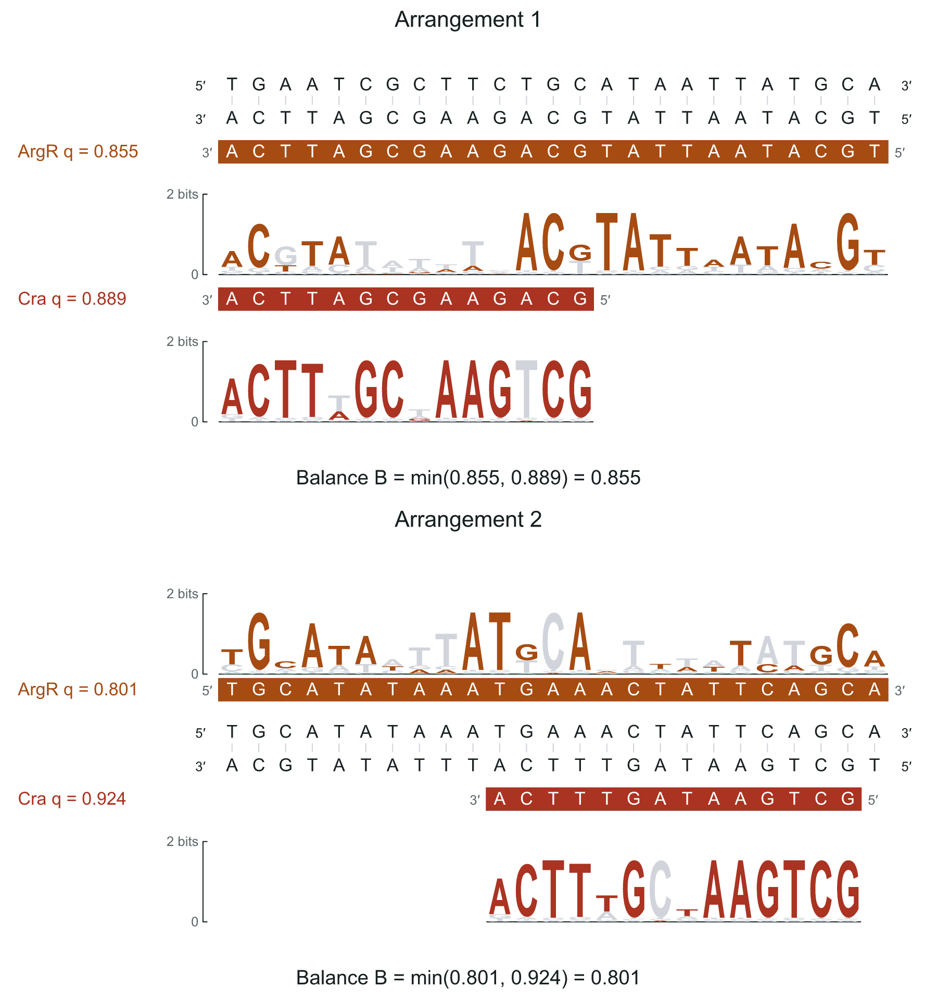

# 

Supply motif models and a DNA length. Motif Balance searches for sequences that
strengthen the weakest desired match while optionally limiting unwanted matches.
Inspect the sites, collect different arrangements, and expand each layout into
nucleotide alternatives.

[Documentation](docs/README.md) ·
[Supply motifs](docs/motif-models.md) ·
[Python API](docs/python-api.md)

## Try a design

Fit the *E. coli* ArgR and Cra preferences into 25 bases. Their models span 25
and 14 positions, so their matches must overlap. The profiles come from the
DAP-seq data in [Baumgart et al. (2021), Supplementary Data 2](https://doi.org/10.1038/s41592-021-01312-2).

### 1. Install and prepare the profiles

With [uv](https://docs.astral.sh/uv/getting-started/installation/) installed:

```bash
# Create a project. The visualization extra adds PNG and video export.
uv init --python 3.12 my-project
cd my-project
uv add 'motif-balance[visualization]'

# Download and check the published data, then write editable inputs.
uv run motif-balance example argr-cra --out argr-cra
cd argr-cra
```

The command caches the checked download. `inputs/motifs/` contains the models,
`SOURCE.json` records their origin, and `design.yaml` sets the DNA length,
requested count, search allowance, and seed. The [preparation guide](examples/argr-cra/README.md)
explains how the probabilities are adjusted.

To see a model, start Python with `uv run python` and enter:

```python
from motif_balance.formats import read_motif

cra = read_motif("inputs/motifs/cra.json")
print(cra)  # Show nucleotide probabilities along the motif.
```

```text
Cra (14 positions)
Background (A C G T): 0.25 0.25 0.25 0.25
Probabilities (3 significant digits)
Position         A         C         G         T
       1    0.0227    0.0227     0.932    0.0227
       2    0.0227     0.932    0.0227    0.0227
       3    0.0227    0.0227    0.0227     0.932
... 9 positions omitted ...
      13    0.0409     0.914    0.0227    0.0227
      14     0.823    0.0227    0.0955    0.0591
```

Position 1 strongly favors G. Scoring converts these probabilities into log-odds
weights, giving positive weights to bases preferred over the background. Exit
Python with `exit()` to continue in the terminal.

### 2. Design and inspect DNA

```bash
# Search 4,096 candidates and return four 25-base sequences.
uv run motif-balance design design.yaml --out result

# Draw the best sequence with its motif matches and scores.
uv run motif-balance inspect result --format png --out candidate.png
```



Each *q* is a motif's best match, rescaled to its own score range. Balance *B*
is the weaker score, **0.855** here. Both strands are scanned. For score tables
and search summaries, use `uv run motif-balance inspect result --format html --out review.html`.

### 3. Collect different arrangements

```bash
# Choose up to two layouts that differ in motif order, strand, or overlap.
uv run motif-balance collect result --count 2 --out collection.json
uv run motif-balance inspect collection.json --format png --out arrangements.png
```



The two representatives score **0.855** and **0.801**. The first is displayed
as the reverse complement of the design above. Collection selection treats
whole-duplex reversal as equivalent and reports any shortfall in the retained
search pool. [Arrangement definitions](docs/choose-alternatives.md)
explain which differences count.

### 4. Expand each arrangement into sequence alternatives

```bash
# Vary covered bases, keeping the selected motif positions and strands.
# Every returned sequence must have balance at least 0.8.
uv run motif-balance expand collection.json --all --min-balance 0.8 --out expanded
```

Each arrangement returns **256 sequences** at the default output limit. Every
sequence meets the floor and retains its parent's selected sites. The `expanded/`
directory contains FASTA sequences and per-motif score tables for each layout.
Other designs can yield fewer alternatives. [Sequence expansion](docs/expand-sequences.md)
explains the checks and work limits.

Use new output names when repeating a step. The [Python tutorial](docs/python-api.md)
uses these same models throughout.

## Design with more motifs

The same request can include more models. Prepare the twelve-model example,
then use the ordinary design command:

```bash
uv run motif-balance example twelve-motifs --out twelve-motifs
# Edit this request to use your own motif files or change the DNA length.
uv run motif-balance design twelve-motifs/design.yaml --out twelve-result
uv run motif-balance inspect twelve-result --format png --out twelve-dna.png
```

This request uses 60 bases and 655,360 evaluations. The recorded run took about
27 minutes on an Apple M2 Pro and reached balance **0.733**. The movie follows
its best sequence as the search improves it. Gray windows show recorded search
candidates; colored windows show the best sequence so far.


[Exact replay](examples/twelve-motifs/README.md#replay-the-recorded-search)
checks the recorded inputs and winner. Use the editable request above for a new design.

Python 3.12–3.14 · Linux and macOS · [MIT license](LICENSE) · [Contributing](CONTRIBUTING.md)

For study data, reproduction, and citation, use the
[Motif Balance Study](https://gitlab.com/dunloplab/motif-balance-study).
Publication DOI: pending.
