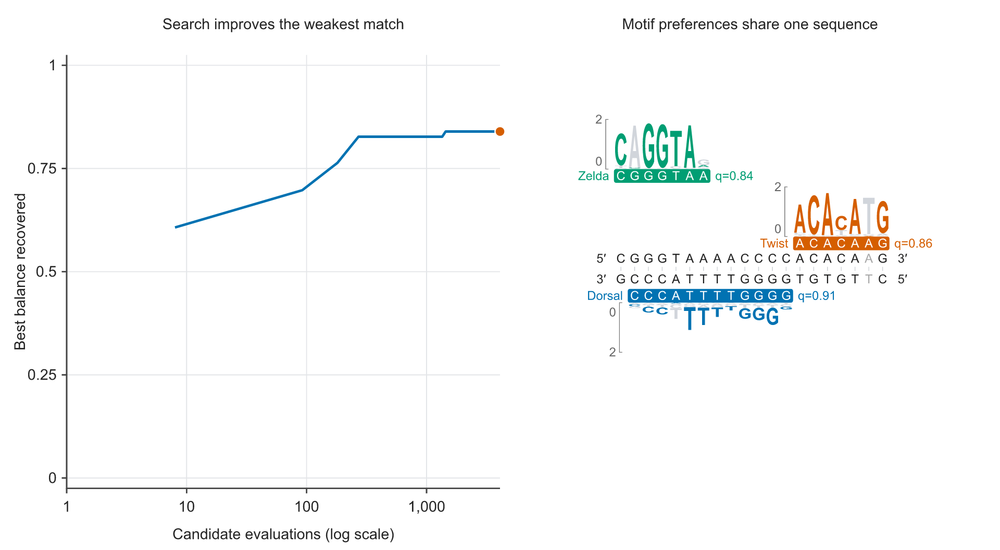

# Design DNA for Dorsal, Twist and Zelda

Dorsal, Twist and Zelda regulate transcription in the early
*Drosophila melanogaster* embryo. Their binding sites have been studied together
in the *snail* distal enhancer ([Syed et al., 2023](https://elifesciences.org/articles/85997)).
Here we ask how their three sequence preferences can fit into a compact DNA
candidate, without prescribing match positions or strands.

The inputs are JASPAR profiles [MA0022.1](https://jaspar.elixir.no/matrix/MA0022.1/)
for Dorsal, [MA0249.3](https://jaspar.elixir.no/matrix/MA0249.3/) for Twist and
[MA1462.2](https://jaspar.elixir.no/matrix/MA1462.2/) for Zelda (source name `vfl`).
Their widths are 12, 7 and 7 bases. A 20-base design is shorter than the combined
26-base span, so some matches must share coordinates. The source count matrices
and prepared probability matrices are included, with explicit conversion rules
and a common equal-frequency scoring background.



[Watch the recorded search](../examples/developmental-trio/playback.mp4) or open the
[vector figure](../examples/developmental-trio/final-frame.svg). Model sources, exact
checksums and CC BY 4.0 attribution are retained in the
[example provenance](../examples/developmental-trio/README.md#input-provenance-and-interpretation).

## Generate and inspect a candidate

After [installing from source](installation.md#install-from-source), run:

```bash
uv run motif-balance design examples/developmental-trio/design.yaml --check
uv run motif-balance design examples/developmental-trio/design.yaml \
  --out /tmp/developmental-trio-result
uv run motif-balance inspect /tmp/developmental-trio-result \
  --format svg --view candidate --out /tmp/developmental-trio-candidate.svg
```

The request uses both strands, one returned sequence, seed 7 and 4,096 complete
candidate evaluations. This is bounded search: the available budget covers only
a small part of the 20-base sequence space. Open the SVG to see the selected
motif windows, sequence complement and aligned information logos.

With a wheel installation, copy the complete
[example folder](../examples/developmental-trio/), including `motifs/` and `source/`,
and use the installed `motif-balance` command against its `design.yaml`.
No research-study files are required.

## Watch recorded search progress

The reproduction script records sampled states from the same search and writes
an interactive HTML view, a static SVG and the observation record:

```bash
uv run python examples/developmental-trio/reproduce.py --out /tmp/developmental-trio-demo
```

The molecule and score trace show the best evaluated sequence at each recorded
snapshot. They do not interpolate unrecorded edits. Individual matches can move
or change strand as search improves the weakest match. The
[playback guide](reference/playback.md) explains how to export your own recorded
search, or display one search chain separately from the running best.

## Change the design question

Copy the request and its motif folder before making changes. Set `length` to
26 to permit separate windows, or to 12 to fit all three matches
within the longest motif span. Search each length independently and inspect the
resulting matches. One seed illustrates the procedure; use repeated seeds to
compare recovery between requests.

For multiple alternatives, keep the generation request unconstrained by sequence
distance and use [collections](choose-alternatives.md) to select distinct
arrangements from its retained candidates. Other transcription factors can be
introduced through [motif preparation](motif-models.md), without changing the
scoring or inspection workflow.
