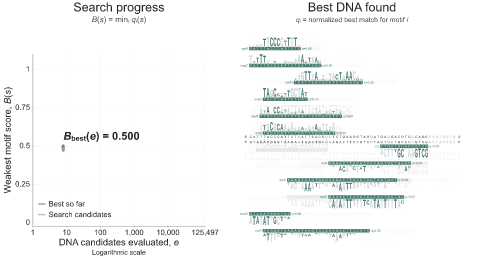

# Follow twelve motif preferences in one DNA search

A motif describes alternative bases at each position. When twelve models share a 60-base sequence, their preferred windows may overlap and compete for the same bases. This example searches for DNA whose weakest relative match is strong.



The left panel follows improvement in the weakest motif match. The right panel shows the corresponding best DNA and its selected motif sites. Each motif score *qᵢ* is its normalized best match. Balance *B(s)* is the weakest score for sequence *s*, and *B* with subscript “best” is the largest balance encountered so far. The final candidate has balance **0.733**. [Inspect the final sequence](../examples/twelve-motifs/final-frame.png) for its nucleotide sequence and motif windows.

The commands below use the source checkout and its locked environment to run
the bundled preparation and playback recipe.

## Prepare the models

The twelve *E. coli* probability profiles come from Baumgart et al. (2021), Supplementary Data 2. The [input record](../examples/twelve-motifs/README.md#inputs-and-interpretation) lists model widths, source attribution and the exact preparation. From the [installed source checkout](installation.md#install-from-source), run:

```bash
# Prepare the twelve published profiles using the recorded source and checksum.
uv run python examples/twelve-motifs/prepare_inputs.py
# Check that the request and all model files are valid before searching.
uv run motif-balance design examples/twelve-motifs/design.yaml --check
```

The preparation script downloads a checksum-verified archive and generates the local models. A request fixes the models, desired roles, DNA length, seed and evaluation allowance. Best-match positions and strands are determined by scanning each proposed sequence.

## Run and inspect the search

```bash
# Repeat the saved request and export its player, movie, preview, and final sequence view.
uv run python examples/twelve-motifs/reproduce.py --out /tmp/twelve-motifs-demo --media
```

The request uses 655,360 complete candidate evaluations. The recorded search took 27.3 minutes elapsed and 0.452 CPU hours in one process on an Apple M2 Pro with 16 GiB memory. Other workstation activity continued during the run. This excludes replay and rendering.

At one tenth of this allowance, the same models and seed recovered balance 0.724. The longer request recovered 0.733. It starts afresh with schedules spread across the larger budget; it does not resume the earlier trajectory. This is one computational example, not an estimate of the improvement expected for other requests.

The inline GIF previews the same movie; open the [full-resolution MP4](../examples/twelve-motifs/playback.mp4) for readable DNA and motif labels. Open generated `playback.html` for an eight-frame overview. Nineteen best-sequence states end at 121,534 evaluations, the first recorded final-best score. The original full observation and its runtime remain separate from this excerpt.

The horizontal axis counts candidate evaluations on a logarithmic scale. The subtitle reports the full run's measured elapsed time. No per-improvement wall-clock measurements were recorded. Motion starts slowly and accelerates at a 20-frame-per-second display rate; it does not represent elapsed search time. Transitions move and crossfade endpoint drawings without supplying intermediate scored DNA. Maintained search chains are omitted from this showcase, so its motion consistently represents the best sequence found so far.

The final sequence establishes that these model scores were attained. It does not establish a best possible sequence or biological activity. To ask a different question, copy the request and change its DNA length, supplied models or evaluation allowance. To request distinct arrangements, use [collections](choose-alternatives.md).
