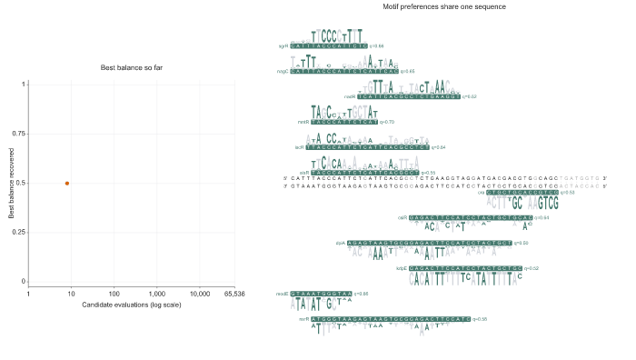

# Twelve motif models in 60 DNA bases

The recorded search asks one 60-base sequence to agree with twelve supplied *E. coli* motif models. Every candidate is scanned on both strands. Its balance is the weakest of the twelve normalized best matches.



[Inspect the final vector frame](final-frame.svg) · [Step-by-step guide](../../docs/biological-example.md)

The displayed candidate has balance **0.724** and was the best among 32 twelve-model searches at 65,536 evaluations. It is a selected realization, not typical recovery. The full selected search took 177.9 seconds elapsed on an Apple M2 Pro with 16 GiB memory while eight search workers ran concurrently. Animation frames are displayed at equal intervals, which do not represent elapsed search time.

## Reproduce

From the installed source checkout with the visualization extra:

```bash
uv run python examples/twelve-motifs/prepare_inputs.py
uv run motif-balance design examples/twelve-motifs/design.yaml --check
uv run python examples/twelve-motifs/reproduce.py --out /tmp/twelve-motifs-demo --media
```

Open the generated `playback.html` for play/pause and frame selection, or inspect the GIF directly. Outputs must use a new directory. `expected.json` records the selected sequence, score, seed and software version; the reproduction script checks agreement. The recorded search used Python 3.12.11, NumPy 2.4.6 and Motif Balance 0.6.0a2.

## Inputs and interpretation

The models are numerical probability records from [Baumgart et al. (2021), Supplementary Data 2](https://doi.org/10.1038/s41592-021-01312-2), inferred from DAP-seq. [SOURCE.json](SOURCE.json) identifies the archive, records, checksums and preparation. The recipe normalizes each row, then mixes it with a uniform distribution using weight 1/11. The scoring background is 0.25 per base.

| Model | Width in bases |
| --- | ---: |
| nagC | 21 |
| kdpE | 22 |
| sgrR | 15 |
| nadR | 20 |
| dpiA | 32 |
| iscR | 24 |
| cra | 14 |
| alsR | 21 |
| modE | 12 |
| nsrR | 31 |
| csiR | 24 |
| mntR | 13 |

Source and prepared matrices are downloaded into ignored `inputs/`, rather than distributed with the repository. The animation and vector frame are newly generated artwork. The input set supplies a computational sharing problem, without asserting that these factors jointly regulate a native sequence. Scores measure agreement with the supplied models, not binding or expression.
